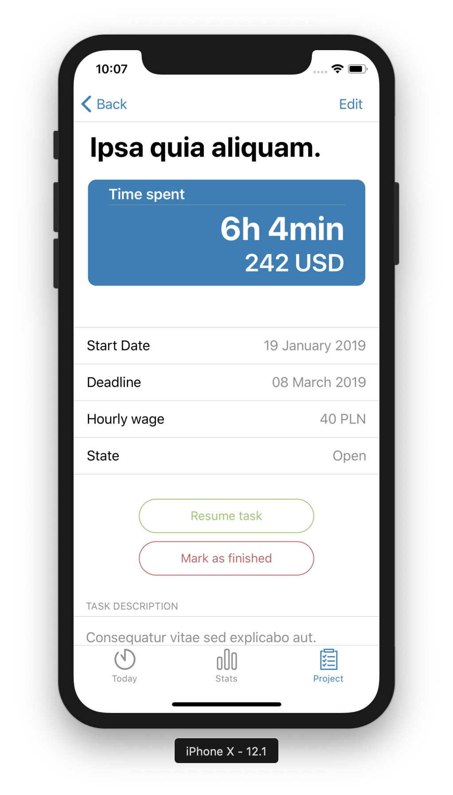
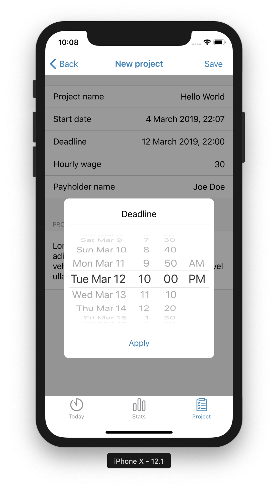

# Tracks
Tracks is a time-tracker app designed for freelancers which helps to manage their projects and time efficiently. Developed using React Native framework.

It needs a server URL to run in non-demo mode (`urlBase` in `config/dataFetch.js`)

##### To run:

>1. This app is designed for iOS devices. You need to have `XCode` installed in order to run the app
>2. Installing dependencies: `npm install`
>3. Running app on simulator: `react-native run-ios`

##### Sample screenshots:

